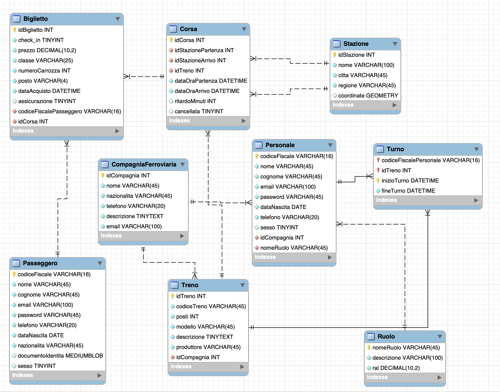

# Progetto di Basi di Dati Riccardo PANELLA: Gestione Treni e Biglietti

## Presentazione

Si vuole realizzare una base di dati per la gestione del trasporto ferroviario nazionale, con un focus sul movimento dei treni, il relativo personle e sulla biglietteria. Per adempiere a questo compito sono state selezionate diverse entità e relazioni.

### Passeggero

Il **Passeggero** rappresenta il cliente che acquista il biglietto per un determinato viaggio in treno. Di lui si vuole sapere l’anagrafica generale e il tipo di documento d'identità; il campo `Sesso` è un booleano in cui 0 rappresenta i maschi e 1 le femmine. È l’utente principale della piattaforma di acquisto.

### Biglietto

Del **Biglietto** si vuole tenere traccia dei seguenti dati: prezzo, classe, numero carrozza, posto, data di acquisto e se è inclusa un'assicurazione per il viaggio. Ogni biglietto è univocamente associato a una sola `Corsa`, `Compagnia` e `Passeggero`.

### Corsa

La **Corsa** rappresenta un singolo viaggio di un treno da una stazione di partenza a una di arrivo in una data e ora specifiche. Di essa si memorizza la stazione di partenza e di arrivo, il treno con cui è stata eseguita, l'orario previsto e quello effettivo, e l'eventuale ritardo o cancellazione. Più biglietti possono appartenere ad una singola corsa.

### Treno

Dei **Treni** salviamo il modello (es. "Frecciarossa 1000"), il numero di posti totali (verrà usato un trigger per non vendere più biglietti della capienza massima), una breve descrizione e il produttore (es. "Hitachi Rail"). Le compagnie ferroviarie possono possedere più treni, ma un treno appartiene ad una sola compagnia.

### Stazione

L'entità **Stazione** rappresenta le fermate fisiche dei treni. Di ogni stazione si memorizzano il nome, la città, l'indirizzo e il numero di binari. Funge da punto di partenza e di arrivo per le corse.

### Turno

Tra `Treno` e `Personale` si crea una tabella di collegamento (cross-table) chiamata **Turno**. Lo scopo è tenere traccia dei turni di lavoro che ogni dipendente svolge su un determinato convoglio durante una o più corse. Per fare ciò, salviamo data e ora di inizio e fine turno.

### Personale

La tabella **Personale** è strutturalmente simile a quella dei `Passeggeri`, in quanto contiene dati anagrafici. Tuttavia, include anche informazioni specifiche come il `Ruolo` ricoperto e la `CompagniaFerroviaria` di appartenenza.

### CompagniaFerroviaria

Dell’entità **CompagniaFerroviaria** si vuole salvare nazionalità, recapiti e una breve descrizione. Essa gestisce le corse, possiede i treni, impiega il personale ed emette i biglietti.

### Ruolo

L’entità **Ruolo** tiene traccia delle mansioni svolte all'interno della compagnia (es. Macchinista, Capotreno, Personale di bordo). Contiene anche la Retribuzione Annua Lorda (RAL) associata e un eventuale referente per quel ruolo.

A differenza del progetto spaziale, si è deciso di **collegare `Corsa` e `CompagniaFerroviaria`** poiché nel mondo reale una specifica corsa è sempre gestita da una singola compagnia. La possibilità di "prestiti" di personale tra compagnie viene mantenuta per flessibilità operativa.

## Scelta delle chiavi primarie

Si adotta uno standard con `idNomeTabella` come identificatori auto-incrementanti per la maggior parte delle tabelle (`Biglietto`, `Corsa`, `CompagniaFerroviaria`, `Stazione`).
- **Passeggero** e **Personale**: Si utilizza il **Codice Fiscale** (stringa di 16 caratteri) come chiave primaria per l'univocità.
- **Treno**: Si adotta un **numero di serie** o un codice identificativo univoco del convoglio (`idTreno`).
- **Stazione**: Sebbene esistano codici ufficiali (es. codici RFI), per semplicità si adotta un `idStazione` auto-incrementante.
- **Ruolo**: Il nome del ruolo (es. "Macchinista") funge da chiave primaria.

## Dizionario dei Dati

| **Entità/Relazione** | **Descrizione** | **Attributi** | **Identificatore** |
|---|---|---|---|
| Passeggero | Utente della piattaforma che acquista biglietti | Nome, Cognome, E-mail, Nazionalità, Password, Sesso, Telefono, DocumentoIdentita, DataNascita | Codice Fiscale |
| Biglietto | Titolo di viaggio che permette di accedere al treno | Prezzo, Classe, Assicurazione, Check-In, PDF, DataAcquisto, NumeroCarrozza, Posto | idBiglietto (auto-increment) |
| Corsa | Viaggio specifico di un treno tra due stazioni | OraPartenzaPrevista, OraArrivoPrevista, OraPartenzaEffettiva, OraArrivoEffettiva, RitardoMinuti, Cancellata | idCorsa (auto-increment) |
| Stazione | Fermata fisica dei treni | Nome, Città, Indirizzo, Regione, NumeroBinari | idStazione (auto-increment) |
| Treno | Veicolo ferroviario che esegue la corsa | Modello, Posti, Descrizione, Produttore, AnnoProduzione | idTreno (codice seriale) |
| Personale | Dipendente della compagnia ferroviaria | Nome, Cognome, E-mail, Password, DataNascita, Sesso, Telefono | Codice Fiscale |
| Turno | Associa il personale al treno per un periodo | InizioTurno, FineTurno | idPersonale + idTreno + InizioTurno |
| CompagniaFerroviaria | Azienda che gestisce treni e corse | Nome, Nazionalità, Telefono, Descrizione, E-mail, PartitaIVA | idCompagnia (auto-increment) |
| Ruolo | Ruolo ricoperto dal personale | NomeRuolo, Descrizione, RAL | NomeRuolo |

## Vincoli non esprimibili

- Non si possono vendere più biglietti rispetto alla quantità di posti disponibili su un treno per una determinata corsa.
- L'assicurazione viaggio, se stipulata tramite canali esterni alla piattaforma, non risulterà nel database.

## Tabella dei volumi (stimata)

| **Concetto** | **Tipo** | **Volume** |
|---|---|---|
| Passeggero | Entità | 2.000.000 |
| Biglietto | Entità | 10.000.000 |
| Corsa | Entità | 500.000 |
| Stazione | Entità | 3.000 |
| Treno | Entità | 10.000 |
| Turno | Relazione | 1.000.000 |
| Personale | Entità | 150.000 |
| CompagniaFerroviaria | Entità | 100 |
| Ruolo | Entità | 200 |


## Diagramma E/R


## Normalizzazione

L'approccio di progettazione mira a rispettare le forme normali per garantire l'integrità dei dati e ridurre le ridondanze:
- **Prima Forma Normale (1NF)**: Rispettata, tutti gli attributi contengono valori atomici.
- **Seconda Forma Normale (2NF)**: Rispettata, tutti gli attributi non-chiave dipendono dall'intera chiave primaria.
- **Terza Forma Normale (3NF)**: Rispettata, non ci sono dipendenze transitive tra attributi non-chiave.

## Diagramma E/R ristrutturato


## Struttura del Database

(https://github.com/papercut456/Esame-Basi-di-Dati-UniTS-Giugno-2025/blob/main/EsameBasiDiDatiGiugno25.sql)

## Schema Logico 



## Esempi di Tabelle

### CompagniaFerroviaria
| idCompagnia | Nome | Nazionalità | Telefono | Email |
|---|---|---|---|---|
| 1 | Trenitalia | Italia | 892021 | info@trenitalia.com |
| 2 | Italo - NTV | Italia | 060708 | info@italotreno.it |
| 3 | SNCF | Francia | 3635 | contact@sncf.fr |

### Treno
| idTreno | Modello | Posti | Produttore | idCompagnia |
|---|---|---|---|---|
| ETR1000-01 | Frecciarossa 1000 | 457 | Hitachi Rail | 1 |
| AGV575-10 | Italo AGV 575 | 462 | Alstom | 2 |
| ETR400-25 | Frecciarossa 1000 | 457 | Hitachi Rail | 1 |

### Stazione
| idStazione | Nome | Città | Indirizzo |
|---|---|---|---|
| 1 | Roma Termini | Roma | Piazza dei Cinquecento |
| 2 | Milano Centrale | Milano | Piazza Duca d'Aosta, 1 |
| 3 | Napoli Centrale | Napoli | Piazza Garibaldi |

### Passeggero

| idPasseggero | nome      | cognome | email                | nazionalità | password | sesso | passaporto | dataNascita | telefono    |
|--------------|-----------|---------|----------------------|-------------|----------|-------|------------|-------------|-------------|
| MarioRossi      | Mario      | Rossi     | mario.rossi@example.com | ITA         | pass123  | 0     |        0x    |       xx/xx/xx      |        +39     |
| MarcoGatti    | Marco      | Gatti   | MarcoGatti@example.com | ITA         | pass123  | 1     |      0x      |    xx/xx/xx         |      +39       |
| ElisaBianchi   | Elisa    | Bianchi | elisa.bianchi@example.com | ITA     | pass123  | 0     |        0x    |     xx/xx/xx        |       +39      |

### Corsa
| idCorsa | idStazionePartenza | idStazioneArrivo | idTreno | OraPartenzaPrevista | OraArrivoPrevista |
|---|---|---|---|---|---|
| 9618 | 1 | 2 | ETR1000-01 | 2025-09-10 09:00:00 | 2025-09-10 12:15:00 |
| 8150 | 2 | 1 | AGV575-10 | 2025-09-10 10:00:00 | 2025-09-10 13:20:00 |

### Biglietto
| idBiglietto | Prezzo | Classe | NumeroCarrozza | Posto | idCorsa | idPasseggero | DataAcquisto |
|---|---|---|---|---|---|---|---|
| 785421 | 89.90 | 2 | 8 | 6D | 9618 | MRORSS80A01H501U | 2025-08-15 |
| 785422 | 129.90 | 1 | 3 | 1A | 8150 | VRDGPP75E59F205Z | 2025-08-20 |

### Ruolo

| idRuolo | Descrizione | Ral    | idReferente |
|------------|----------------------|--------------------|-----------|
| R1       | Macchinista                  | 35500                | ID123  |
| R2       | CapoTreno                  | 35000           |  ID124 |
| R3       | AddettoPulizie             | 20000                | ID125  |

### Personale
| CodiceFiscale | Nome | Cognome | Email | idCompagnia | idRuolo |
|---|---|---|---|---|---|
| BNCLCA70A01F205X | Luca | Bianchi | l.bianchi@trenitalia.it | 1 | Macchinista |
| GRGNTN85A41H501Y | Antonia | Greco | a.greco@italotreno.it | 2 | Capotreno |

### Turno
| idPersonale | idTreno | InizioTurno | FineTurno |
|---|---|---|---|
| BNCLCA70A01F205X | ETR1000-01 | 2025-09-10 08:00:00 | 2025-09-10 16:00:00 |
| GRGNTN85A41H501Y | AGV575-10 | 2025-09-10 09:30:00 | 2025-09-10 17:30:00 |

---

## Trigger e Stored Procedures Adattati

### Trigger

#### Trigger per Controllare la Disponibilità dei Posti

Questo trigger, eseguito prima di un inserimento nella tabella `biglietto`, verifica che ci siano ancora posti disponibili sul treno assegnato alla corsa.

```sql
DELIMITER $$
CREATE TRIGGER trg_ControlloPostiDisponibili BEFORE INSERT ON biglietto
FOR EACH ROW
BEGIN
    DECLARE bigliettiVenduti INT;
    DECLARE postiDisponibili INT;

    -- Conta i biglietti già venduti per quella corsa
    SELECT COUNT(*) INTO bigliettiVenduti
    FROM biglietto
    WHERE idCorsa = NEW.idCorsa;

    -- Ottiene la capienza massima del treno usato per quella corsa
    SELECT t.Posti INTO postiDisponibili
    FROM corsa c
    INNER JOIN treno t ON c.idTreno = t.idTreno
    WHERE c.idCorsa = NEW.idCorsa;

    -- Se i biglietti venduti superano o eguagliano i posti, lancia un errore
    IF bigliettiVenduti >= postiDisponibili THEN
        SIGNAL SQLSTATE '45001' SET MESSAGE_TEXT = 'Treno Pieno! Impossibile emettere il biglietto.';
    END IF;
END$$
DELIMITER ;
